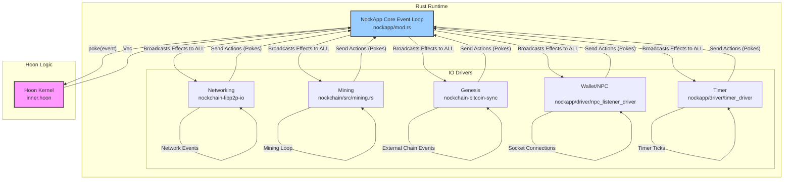

# Nockchain: A Comprehensive Architectural Overview

This document provides a complete and comprehensive overview of the Nockchain project, detailing its architecture, the interplay between its Rust and Hoon components, and the primary code paths for core functionality like mining and networking.

## 1. High-Level Architecture: The "Pure Core" Model

Nockchain's architecture is built on a fundamental separation of concerns, isolating a pure, deterministic core from a world of messy, non-deterministic side effects.

*   **The Hoon Kernel (`inner.hoon`)**: A single, deterministic state machine that defines all the rules of the blockchain. It is written in Hoon and compiled to a `.jam` file. It has no direct access to the outside world (no networking, no disk I/O, no timers). Its logic is pure: the same state plus the same input will always produce the same new state and the same list of outputs.

*   **The Rust Runtime (`nockapp`)**: A host environment that manages all I/O and side effects. It runs the Hoon kernel in a Nock VM and communicates with it via a strict, asynchronous messaging protocol. It is responsible for translating external world events into a language the kernel can understand, and for taking the kernel's abstract commands and executing them.

This design allows the complex, stateful logic of the blockchain to be defined and validated in a high-level, auditable language (Hoon), while the performance-critical and non-deterministic tasks of networking, disk access, and user interaction are handled by efficient, low-level Rust code.

### Architectural Diagram

### Key Crates and Components

*   **`hoonc`**: The Hoon compiler. It takes all `.hoon` source files and compiles them into a single `.jam` file that `nockapp` can execute.
*   **`nockvm`**: The Nock virtual machine. The low-level interpreter that executes the compiled Hoon code.
*   **`nockapp`**: The core runtime engine. It loads a kernel, manages the main event loop (`work`), and provides the `NockAppHandle` for drivers to interact with the kernel.
*   **`nockchain`**: The main binary crate that assembles all other components, configures them based on CLI arguments, and launches the `nockapp`.
*   **IO Drivers**: Asynchronous Rust modules that handle specific side effects. Key drivers include:
    *   `nockchain-libp2p-io`: Manages the `libp2p` swarm for all peer-to-peer interactions.
    *   `nockchain-bitcoin-sync`: Handles the genesis event.
    *   `mining_driver`: The proof-of-work mining loop.
    *   `npc_listener_driver`: Listens on a Unix socket for connections from the `nockchain-wallet`.
    *   `timer_driver`: Periodically sends "tick" events to the kernel.
*   **`hoon/apps/dumbnet/inner.hoon`**: This is the application kernel—the "brain" of the blockchain. It defines the state, the transaction format, consensus rules, and all valid state transitions.
*   **`hoon/apps/dumbnet/lib/types.hoon`**: The data dictionary for the entire system. It defines the shape of the kernel's state and, most importantly, the vocabulary of all `pokes` and `effects`.

## 2. The Poke/Effect Model: Rust <=> Hoon Communication

Communication between the Rust runtime and the Hoon kernel follows a strict, asynchronous pattern managed by the `NockApp` event loop.

*   **Pokes (Events)**: When an external event occurs (e.g., a message arrives from the network), the corresponding Rust IO driver creates a **poke**. A poke is a noun (Hoon's fundamental data structure) that represents the event. The driver sends this poke as an `IOAction` to the `NockApp`'s central channel.

*   **The `work` Loop**: The `NockApp`'s main `work` loop receives the `IOAction` and calls `handle_poke`. This function passes the noun to the single-threaded `kernel.poke()` method. This is the moment of crossover from the Rust world to the Hoon world.

*   **Effects (Commands)**: The Hoon kernel processes the poke according to its internal logic. This may result in a state change. The `kernel.poke()` function then returns a `Vec<NounSlab>`, a list of **effects**. An effect is a noun that represents a command for the outside world (e.g., "gossip this block to peers," "ban this peer," "start mining this block header").

*   **Broadcasting**: The `NockApp` loop receives this list of effects and broadcasts each one to **all** listening drivers via a `tokio::sync::broadcast` channel. Every driver receives every effect and is responsible for filtering and acting only on the ones relevant to it.

This model ensures the Hoon kernel remains pure and deterministic. It never *does* anything; it only reacts to pokes and *describes* what should be done via effects.

## 3. Core Code Paths

### A. Mining a New Block

1.  **`[%timer]` Poke**: The `timer_driver` in Rust periodically sends a poke to the kernel.
2.  **Candidate Creation (Hoon)**: `inner.hoon` receives the timer poke. It checks if it's time to make a new block. If so, it gathers pending transactions and assembles a `candidate-block` in its `mining-state`.
3.  **`[%mine]` Effect**: The kernel produces a `[%mine ...]` effect containing the block header data needing a proof-of-work.
4.  **Mining Loop (Rust)**: The `mining_driver` receives the `[%mine]` effect. It enters a tight loop, hashing the block header with different nonces using the `equix` PoW algorithm.
5.  **`[%pow]` Poke**: Once a solution is found, the `mining_driver` sends a `[%pow ...]` poke back to the kernel, containing the solution.
6.  **Validation and Gossip (Hoon)**: The kernel receives the `[%pow]` poke. It verifies the solution. If correct, it finalizes the block, updates its consensus state, and produces a `[%gossip %heard-block ...]` effect containing the newly minted block.
7.  **Broadcast (Rust)**: The `nockchain-libp2p-io` driver receives the gossip effect and broadcasts the block to all connected peers.

### B. Submitting a Transaction

1.  **Wallet Connects**: The user runs `nockchain-wallet`. It connects to the `nockchain` node via the Unix socket managed by the `npc_listener_driver`.
2.  **Transaction Poke**: The wallet sends the raw transaction data. The `npc_listener_driver` wraps this in a `[%heard-tx ...]` poke and sends it to the kernel.
3.  **Validation (Hoon)**: The kernel receives the transaction poke. It validates the transaction's signatures and structure. If valid, it adds it to the `pending-state` (mempool). It then emits a `[%gossip %heard-tx ...]` effect.
4.  **Broadcast (Rust)**: The `nockchain-libp2p-io` driver receives the gossip effect and broadcasts the raw transaction to its peers.

### C. Receiving a Block from the Network

1.  **Inbound Message (Rust)**: The `nockchain-libp2p-io` driver receives a block from a peer.
2.  **`[%heard-block]` Poke**: The driver wraps the block in a `[%heard-block ...]` poke. This is the **exact same type of poke** that would be generated by a wallet submitting a block.
3.  **Validation (Hoon)**: The Hoon kernel handles the poke. It performs all consensus checks (PoW, transactions, etc.). If the block is valid and not a duplicate, it's added to the `consensus-state`. Importantly, the kernel does **not** produce a new `[%gossip]` effect in this case, which prevents an infinite loop of re-gossiping the same block.

## 4. Summary: A Unified System

Nockchain's power comes from this unified, event-driven design. Whether a block is mined locally, a transaction is submitted by a user, or a block is received from the network, it enters the Hoon kernel through the same pattern of pokes. The kernel acts as the single source of truth for all state transitions, and its logic is completely independent of where an event originated. The Rust IO drivers are responsible for translating all interactions with the chaotic outside world into this simple, deterministic stream of pokes, and for faithfully executing the kernel's resulting commands. 